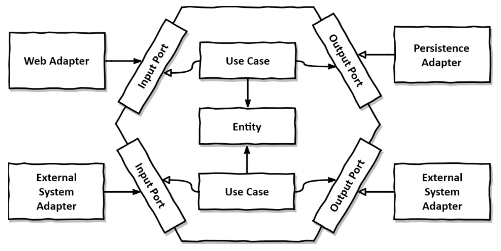

<div align="center">

<h1> [ Hexagonal Architecture ] </h1>

<b>회원 API를 구현하며 헥사고날 아키텍처 구조에 대해 학습</b>

</div>



> 이미지 출처: https://reflectoring.io/spring-hexagonal

### 도메인 정의
- 사용자
  1. 기사 (tasker)
  2. 이용자 (member)

### 구현 내용
- 헥사고날 아키텍처 구조로 간단한 회원 API 설계 및 구현
  - 회원 가입
  - 유저 정보 조회
  - 유저 정보 수정
  - 회원 탈퇴
- junit5를 이용한 단위 테스트
  - 사용자 인메모리 저장소
  - 유저 서비스 로직
  - 도메인 제약조건
    - Email
    - Nickname
  - 사용자 생성 규칙

## Directory Structure
```
src
    ├── main
    │   ├── java
    │   │   └── com
    │   │       └── github
    │   │           └── conagreen
    │   │               └── hexagon
    │   │                   ├── user
    │   │                   │    ├── adapter
    │   │                   │    │   ├── in
    │   │                   │    │   │   └── api
    │   │                   │    │   │       ├── LeaveHexagonServiceResponse.java
    │   │                   │    │   │       ├── SearchHexagonUserResponse.java
    │   │                   │    │   │       ├── SignUpHexagonUserResponse.java
    │   │                   │    │   │       ├── UpdateHexagonUserResponse.java
    │   │                   │    │   │       ├── UserController.java
    │   │                   │    │   │       ├── UserSignUpParameter.java
    │   │                   │    │   │       └── UserUpdateParameter.java
    │   │                   │    │   └── out
    │   │                   │    │   │   └── persistence
    │   │                   │    │   │       ├── HexagonUserPersistenceAdapter.java
    │   │                   │    │   │       ├── HexagonUserRepository.java
    │   │                   │    │   │       └── InmemoryHexagonUserRepository.java
    │   │                   │    ├── application
    │   │                   │    │   ├── port
    │   │                   │    │   │   ├── in
    │   │                   │    │   │   │   ├── EmailAlreadyTakenException.java
    │   │                   │    │   │   │   ├── LeaveHexagonServiceCommand.java
    │   │                   │    │   │   │   ├── LeaveHexagonServiceResult.java
    │   │                   │    │   │   │   ├── LeaveHexagonServiceUseCase.java
    │   │                   │    │   │   │   ├── SearchHexagonUserQuery.java
    │   │                   │    │   │   │   ├── SearchHexagonUserQueryResult.java
    │   │                   │    │   │   │   ├── SearchHexagonUserUseCase.java
    │   │                   │    │   │   │   ├── SignUpHexagonUserCommand.java
    │   │                   │    │   │   │   ├── SignUpHexagonUserResult.java
    │   │                   │    │   │   │   ├── SignUpHexagonUserUseCase.java
    │   │                   │    │   │   │   ├── UpdateHexagonUserCommand.java
    │   │                   │    │   │   │   ├── UpdateHexagonUserResult.java
    │   │                   │    │   │   │   └── UpdateHexagonUserUseCase.java
    │   │                   │    │   │   └── out
    │   │                   │    │   │       ├── DeleteHexagonUserPort.java
    │   │                   │    │   │       ├── LoadHexagonUserPort.java
    │   │                   │    │   │       ├── SaveHexagonUserPort.java
    │   │                   │    │   │       └── UpdateHexagonUserPort.java
    │   │                   │    │   └── services
    │   │                   │    │       ├── LeaveHexagonServiceService.java
    │   │                   │    │       ├── SearchHexagonUserQueryService.java
    │   │                   │    │       ├── SignUpHexagonUserService.java
    │   │                   │    │       └── UpdateHexagonUserService.java
    │   │                   │    └── domain
    │   │                   │        ├── Email.java
    │   │                   │        ├── HexagonUser.java
    │   │                   │        ├── HexagonUserId.java
    │   │                   │        ├── Nickname.java
    │   │                   │        ├── TaskerUser.java
    │   │                   │        ├── TaskerUserId.java
    │   │                   │        └── UserProfile.java
    │   │                   └── HexagonApplication.java           
    │   └── resources
    │       └── application.properties
    └── test
        └── java
            └── com
                └── github
                    └── conagreen
                        └── hexagon
                            ├── user
                            │   ├── adapter
                            │   │   └── out
                            │   │       └── persistence
                            │   │           └── InmemoryHexagonUserRepositoryTest.java
                            │   ├── application
                            │   │   └── services
                            │   │       ├── LeaveHexagonServiceServiceTest.java
                            │   │       ├── SearchHexagonUserQueryServiceTest.java
                            │   │       ├── SignUpHexagonUserServiceTest.java
                            │   │       └── UpdateHexagonUserServiceTest.java
                            │   └── domain
                            │       ├── EmailTest.java
                            │       ├── HexagonUserTest.java
                            │       └── NicknameTest.java
                            └── HexagonApplicationTests.java
```
